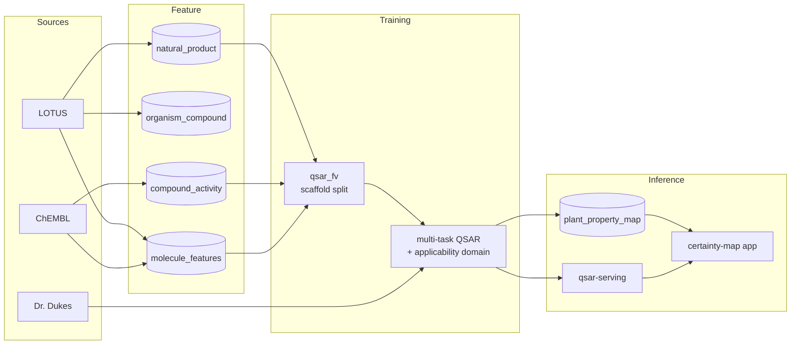

# the-untested

[](https://github.com/MagicLex/awesome-ml-systems)
[](https://www.hopsworks.ai/)

Predict the bioactivity of natural products that nobody ever assayed, from their
molecular structure, aggregate the predictions up to the source plants and fungi,
and render a plant-by-property certainty map. The demo foregrounds antimicrobial
resistance (AMR).

The thesis: train QSAR on every compound ChEMBL has measured, score the ~185k
LOTUS natural products that were never tested, and show which untested plants
likely carry activity, with calibrated confidence over where the model is blind.

Status: **building.** Feature pipelines landing (LOTUS map + ChEMBL labels);
training and serving next. Not yet published or catalogued.

## The honest experiment

The map is only useful if the discipline below holds. These rules are part of
the spec:

- **Scaffold split, never random.** Score the model on structurally novel
  molecules (Bemis-Murcko scaffold grouping), the same job it does live. Random
  splits leak analogs and inflate the numbers.
- **Beat the priors, or nothing was earned.** Headline is lift over the
  taxonomic prior (same plant family as a known-active plant) and the folk prior
  (already used in ethnobotany), both already sitting in the data.
- **Applicability domain is first-class.** Every prediction carries a calibrated
  confidence from distance to the training set in chemical space. A molecule
  outside what the model has seen returns "unknown," not a confident wrong
  answer.
- **Coverage per plant.** A plant verdict is only as good as the fraction of its
  chemistry we actually know. Shown next to every prediction.
- **Binding-active is not a cure.** Assay activity is not a medicine in a human.
  Loud and permanent. This is a research triage tool, not medical advice.

## Data

| source | gives | scale |
|---|---|---|
| [LOTUS](https://lotus.naturalproducts.net/) | plant to molecule, SMILES, taxonomy, chemical class | 544k links, 227k molecules, 37k organisms |
| [ChEMBL](https://www.ebi.ac.uk/chembl/) | molecule to target, pchembl potency label | 2.9M compounds; ~42k overlap with LOTUS |
| [Dr. Duke's](https://phytochem.nal.usda.gov/) | plant to chemical, ethnobotanical use | folk-prior baseline |

Join key across all sources: InChIKey. Train on all labelled ChEMBL compounds;
the natural-product overlap is the validation slice; the untested naturals are
the prediction set.

## Shape



## Build

```
make lotus-job     # F1  LOTUS map + molecule structures + taxonomy
make chembl-job    # F2  ChEMBL bioactivity labels (bulk SQLite)
make envs          # clone the RDKit featurize env
# F3 featurize, T train, I serve + app land as the sprint proceeds
```

Full specification: [`reqs/the-untested.md`](reqs/the-untested.md).
