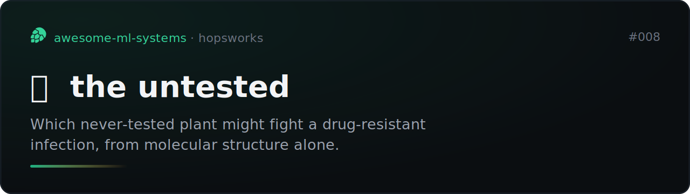
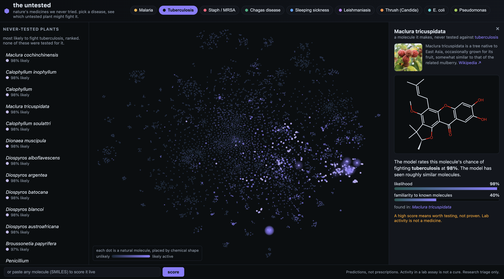
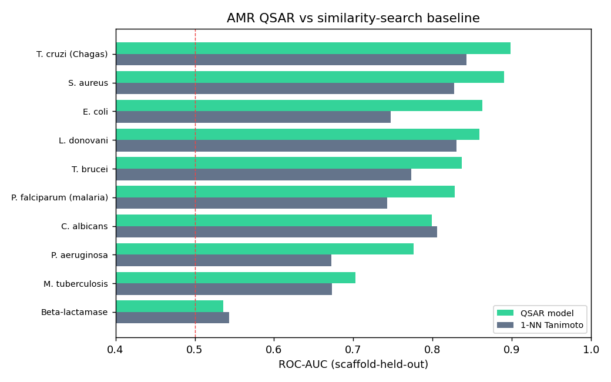
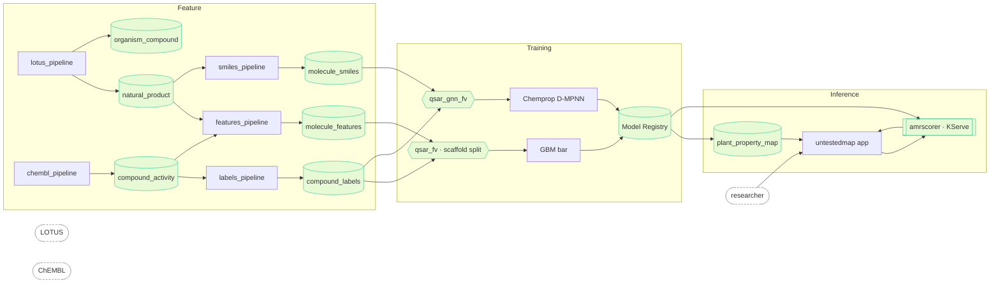

# the-untested



[](https://github.com/MagicLex/awesome-ml-systems)
[](https://www.hopsworks.ai/)

Which plant nobody ever tested might fight a drug-resistant infection? This
predicts the antimicrobial activity of natural products that were never assayed,
from molecular structure alone, and renders the answer as a chemical-space
certainty map over the source plants, fungi and microbes. It trains on every
compound ChEMBL has measured and scores the ~227k LOTUS naturals that no one ever
put on a plate. It beats a 1-NN similarity-search baseline on every scored
disease (mean ROC-AUC **0.80**), and the tell that it works: ranking the untested
naturals for malaria surfaces three *Artemisia* species, the artemisinin genus,
in the top six, from structure alone.



## The result

`amr_qsar`, a per-target gradient-boosted QSAR over the 2048-bit Morgan
fingerprint and 10 descriptors, one head per pathogen. It is scored on
structurally novel molecules (Bemis-Murcko scaffold split, the same job it does
live) against the 1-NN Tanimoto similarity-search baseline every real QSAR must
beat. The served model is `amr_qsar` v1; later versions register with their own
metrics and are promoted by hand, not automatically.

| metric | value |
|---|---:|
| mean AMR ROC-AUC (scaffold-held-out) | **0.80** |
| lift over 1-NN Tanimoto | positive on every scored head, +0.05 mean |
| strongest head (S. aureus) | 0.90 |
| weakest kept head (M. tuberculosis) | 0.69 |
| training compounds | 176k labelled |



Strong heads: S. aureus 0.90, T. cruzi 0.89, L. donovani 0.85, E. coli 0.85,
C. albicans 0.84, P. falciparum 0.83. Weak: P. aeruginosa 0.74, M. tuberculosis
0.69. Beta-lactamase scores 0.54 and loses to the baseline, a dud kept and
flagged rather than hidden.

The validation that matters is on the untested set. Ranking the 227k naturals
for antimalarial activity surfaces three *Artemisia* species in the top six.
*Artemisia* is the genus of artemisinin, the frontline antimalarial, recovered
from structure alone: per-molecule score 0.98 against a family taxonomic prior of
0.21.

## Caveats

Read these before quoting the number anywhere.

- **Binding-active is not a cure.** A high score means a molecule looks like
  things that were active in a lab assay. It is a research triage signal, not a
  medicine in a human. This is loud and permanent across the app.
- **Scaffold split, never random.** The model is scored on molecules whose
  chemical scaffold was held out. Random splits leak close analogs and inflate
  the numbers.
- **Applicability domain is first-class.** Every prediction carries a
  familiarity, the distance to the training set in chemical space. A molecule
  unlike anything the model has seen reads as a long shot, not a confident answer.
- **The panel is what has data.** Only pathogens with enough public ChEMBL
  activity get a head. These are the neglected and resistant diseases people
  screen against, which is not the same as diseases anyone can cure.

## Architecture

An FTI (feature, training, inference) system on Hopsworks. The join key across
every source is the InChIKey. Training reads through a feature view so serving
selects the same features the same way, with no train/serve skew: a molecule
scores identically on the endpoint and in the batch map.



Training is staged. Stage 1 is the fingerprint GBM above, the bar. Stage 2 is a
multi-task message-passing GNN (Chemprop D-MPNN) over the molecule graph, served
the same labels through `qsar_gnn_fv` on canonical SMILES, evaluated on the exact
same scaffold-held-out test set. It promotes only if it clears the stage-1 bar.

The sources:

| source | gives | scale |
|---|---|---|
| [LOTUS](https://lotus.naturalproducts.net/) | organism to molecule, SMILES, taxonomy, chemical class | 544k links, 227k molecules, 37k organisms |
| [ChEMBL](https://www.ebi.ac.uk/chembl/) | molecule to target, pchembl potency label | 2.9M compounds, ~42k overlap with LOTUS |

The file-by-file map:

```
chem_features.py                 shared, skew-free: SMILES -> Morgan fp + scaffold + descriptors
panel.py                         the AMR target panel, single source of truth
pipelines/lotus_pipeline.py      F1   LOTUS -> natural_product + organism_compound   (Hopsworks job)
pipelines/chembl_pipeline.py     F2   ChEMBL bulk -> compound_activity               (Hopsworks job)
pipelines/labels_pipeline.py     F2b  pivot the panel -> wide compound_labels        (Hopsworks job)
pipelines/features_pipeline.py   F3   Morgan fingerprints -> molecule_features       (Hopsworks job)
pipelines/smiles_pipeline.py     F3b  canonical SMILES -> molecule_smiles, graph input (Hopsworks job)
pipelines/train.py               T1   qsar_fv -> amr_qsar, the GBM bar -> registry    (Hopsworks job)
pipelines/gnn_train.py           T2   qsar_gnn_fv -> Chemprop D-MPNN, gated on the bar (Hopsworks job)
pipelines/map_pipeline.py        I1   score untested naturals -> plant_property_map   (Hopsworks job)
serving/                         I2   amrscorer predictor + KServe deploy
app/                             A1   untestedmap certainty-map + discovery app
tools/                           schedule.py, build_envs.py
reqs/the-untested.md             the FTI specification
```

## Reproduce

Clone into a Hopsworks project on the `/hopsfs/...` FUSE mount. Paths self-derive,
nothing is hardcoded to a username. All data is free bulk, no keys.

```bash
make envs           # clone the RDKit / torch envs (featurize / train / gnn / serve / app)
make lotus-job      # F1   LOTUS map + molecule structures + taxonomy
make chembl-job     # F2   ChEMBL bioactivity labels (bulk SQLite)
make labels-job     # F2b  pivot the panel into the wide multi-task label group
make features-job   # F3   Morgan fingerprints -> molecule_features
make smiles-job     # F3b  canonical SMILES -> molecule_smiles (graph input)
make train-job      # T1   multi-task QSAR (scaffold split, vs 1-NN baseline)
make map-job        # I1   score the untested naturals -> plant_property_map
make serve          # I2   amrscorer on-demand endpoint
make app            # A1   untestedmap app
```

## The demo

`untestedmap`: a chemical-space map where every dot is an untested natural
product, placed by molecular shape (t-SNE of the fingerprints, so neighbours are
structurally alike). Pick a disease and the map recolours by predicted activity;
the attention rail ranks the plants, fungi and microbes most likely to carry it,
none ever tested for it. A dossier draws the molecule, links the source organism
to Wikipedia, and shows the familiarity to known chemistry so an out-of-domain
guess reads as a long shot. A live box scores any pasted SMILES against every
disease.

The **broad-spectrum** view recolours the same map by how many diseases a
molecule is predicted to hit at once. It surfaces the rare multi-target naturals,
and flags the ones the model has seen little of, where broad activity is as
likely a frequent-hitter artifact as a real lead. Every screen repeats one rule:
activity in an assay is a triage signal, not a medicine.

Full specification: [`reqs/the-untested.md`](reqs/the-untested.md).
